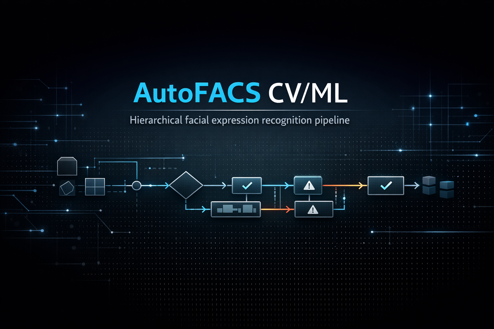
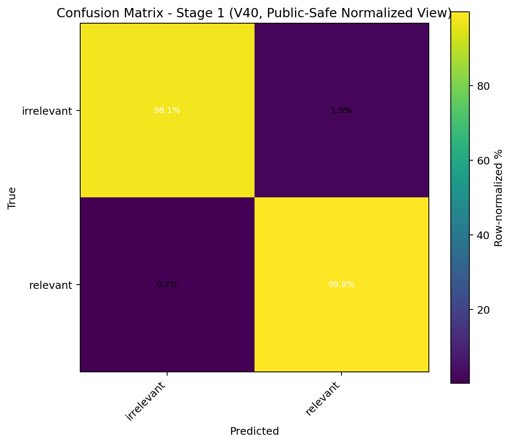
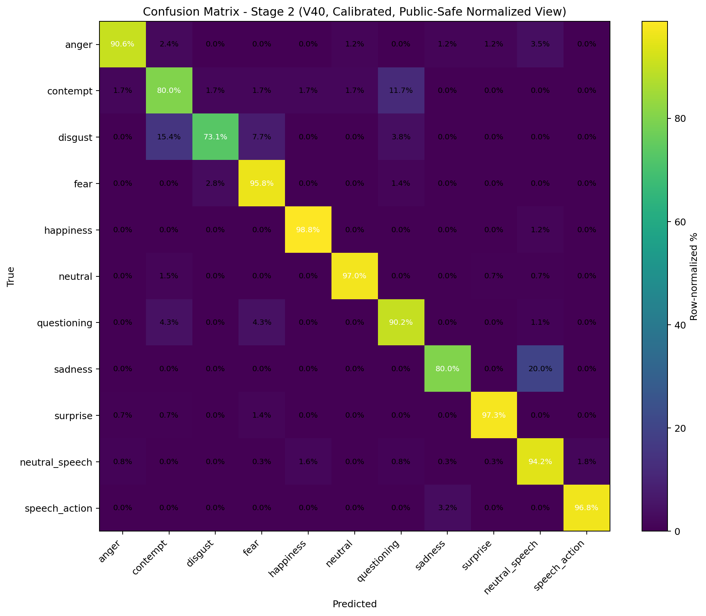
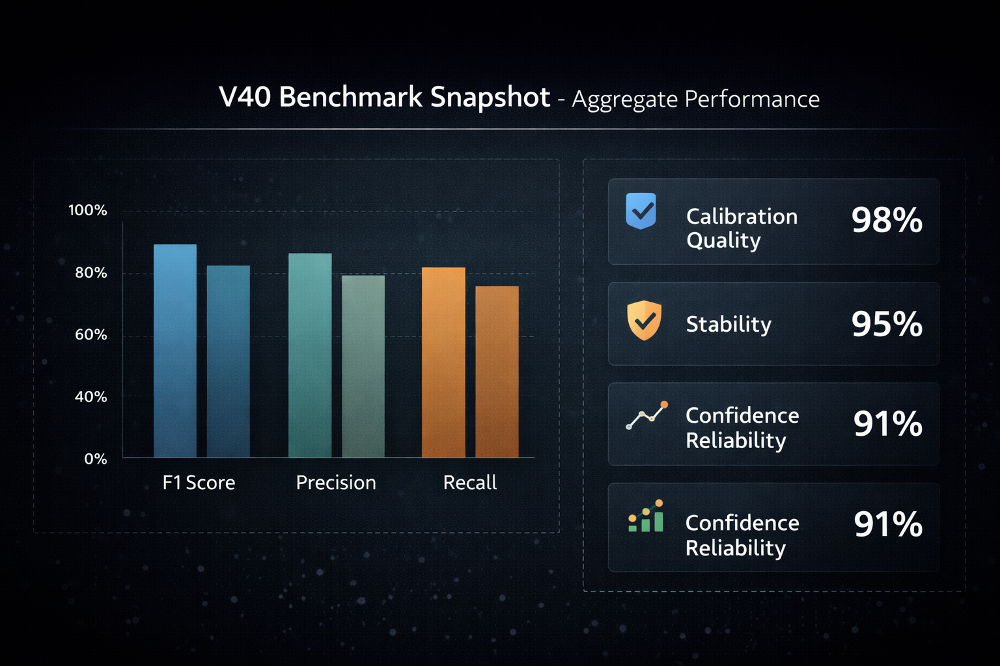

# AutoFACS CV/ML

AutoFACS CV/ML is the computer-vision and machine-learning track of the broader **AutoFACS** program. It is a FACS-informed facial expression recognition project built around staged classification, human-guided curation, reliability-aware evaluation, and Apple Silicon–constrained development.

**FACS** stands for the **Facial Action Coding System**, a research framework for describing visible facial movement in terms of Action Units rather than vague impressionistic labels. It was introduced by **Paul Ekman** and **Wallace V. Friesen**, with a later major update by **Paul Ekman, Wallace V. Friesen, and Joseph C. Hager**.

This repository is a **selective public technical snapshot**. It explains what the project is, how it is structured, what the V40 baseline demonstrated, and where the project is headed, while leaving out private data surfaces, checkpoints, and other disclosure-sensitive internals.



## Live demo

A public demo is available through [**Hugging Face Spaces**](https://huggingface.co/spaces/TFJune2025/autofacs-cv-ml):

- single-image inference
- batch image inference
- constrained short-video clip analysis

This demo provides live image and short-video inference for the public-facing AutoFACS CV/ML pipeline and showcases the V40 baseline.

## Project positioning

AutoFACS CV/ML began as an effort to automate FACS-oriented facial-expression labeling for time-localized inference on recorded video. Over time, the project evolved from early benchmarking against open-source code and datasets into a more independent system built around:

- curated facial-expression data assembly
- staged CV/ML modeling rather than a flat one-step classifier
- error-driven iteration and hard-negative review
- reliability-aware evaluation
- disclosure-conscious public documentation while IP work is still active

The project uses internal **V-series tags** (`V10`, `V20`, `V30`, `V40`, and so on) to mark major generations of data, modeling, and pipeline refinement. In this repository, **V40** refers to the stable baseline generation used for the selected results summarized below.

## What this repository covers

This repository documents:

- the problem framing and project scope
- the staged system architecture
- data boundaries and curation posture
- model/training design at an appropriate public level
- selected V40 evaluation results
- engineering lessons and roadmap context

It does **not** publish:

- raw datasets or face imagery
- identities or sensitive annotations
- private filenames or internal absolute paths
- model weights/checkpoints
- full private training infrastructure
- patent-sensitive implementation detail beyond what is needed for a portfolio-grade technical record

## V40 snapshot

The strongest quantitative story in this repository comes from the **V40** baseline.

### Stage 1 relevance filtering



In this project, **relevant** means a sample falls inside the curated downstream state space that Stage 2 is designed to classify. **Irrelevant** is a deliberate catch-all class for everything outside that clean 11-label scope, including ambiguous, uncategorized, weakly curated, or otherwise out-of-scope facial material. Stage 1 therefore serves as more than a simple quality gate: it defines the operational boundary between the project’s curated target taxonomy and the much larger real-world expression space.

- Best reported Stage 1 row: **epoch 2**
- Macro F1: **0.990**
- `relevant` F1: **0.985**
- `irrelevant` F1: **0.995**

### Stage 2 calibrated expression/state classification



- Reported calibrated snapshot: **epoch 5.985**
- Macro F1: **0.902**
- Strong-performing classes included:
  - `neutral`: **0.978**
  - `surprise`: **0.976**
  - `happiness`: **0.973**
  - `neutral_speech`: **0.951**
- Harder classes that continued to motivate curation and routing work included:
  - `contempt`: **0.793**
  - `disgust`: **0.792**
  - `sadness`: **0.853**
  - `speech_action`: **0.882**

### Selective V40 Benchmark Snapshot


## Why the project uses a staged design

The project record supports a **hierarchical two-stage pipeline**:

1. a **relevance filter** that screens incoming samples
2. a downstream **expression/state classifier** operating on the filtered inputs
3. review/routing logic for ambiguous or difficult cases

A practical lesson from the project was that meaningful facial-state classification in real footage could not be treated as a single flat labeling problem. Speech-active frames, neutral baselines, weak or unusable inputs, and hard confusions all had to be handled deliberately for the system to become useful.

### System Architecture Snapshot


## Current status

**Status:** active research-engineering snapshot with a stable V40 baseline and ongoing broader AutoFACS development.

This repo should be read as a serious documentation-first public package rather than a full reproducibility release.

## Documentation map

- [Docs index](docs/README.md)
- [Project overview](docs/PROJECT_OVERVIEW.md)
- [Architecture](docs/ARCHITECTURE.md)
- [Data and boundaries](docs/DATA_AND_BOUNDARIES.md)
- [Model and training](docs/MODEL_AND_TRAINING.md)
- [Evaluation and results](docs/EVALUATION_AND_RESULTS.md)
- [Engineering lessons](docs/LIMITATIONS_AND_LESSONS.md)
- [Project direction and related tracks](docs/ROADMAP.md)
- [Public code included in this repository](docs/PUBLIC_CODE_CANDIDATES.md)

## Repository structure

```text
.
├── assets/
│   └── README.md
├── docs/
│   ├── README.md
│   ├── PROJECT_OVERVIEW.md
│   ├── ARCHITECTURE.md
│   ├── DATA_AND_BOUNDARIES.md
│   ├── MODEL_AND_TRAINING.md
│   ├── EVALUATION_AND_RESULTS.md
│   ├── LIMITATIONS_AND_LESSONS.md
│   ├── PUBLIC_CODE_CANDIDATES.md
│   ├── ROADMAP.md
│   └── img/
│       └── README.md
├── examples/
│   ├── README.md
│   ├── curation_patch_builder_example.py
│   ├── hf_space_app.py
│   ├── infer_image.py
│   ├── infer_video_clip.py
│   ├── model_config.example.json
│   ├── plot_v40_results.py
│   ├── preprocessor_config.example.json
│   ├── source_ingestion_example.py
│   └── stage1_filter_example.py
├── .gitignore
├── LICENSE.md
├── README.md
├── REPO_TOPICS.txt
└── SITE_SUMMARY.md
```

## Related project tracks

- **AutoFACS CV/ML** — the domain/model/data/evaluation track documented here
- **[AutoFACS CLI Automation](https://github.com/TFJune2025/autofacs-cli-automation)** — the companion repository for the governed CLI/control-plane layer intended to automate and harden workflows around the broader AutoFACS program

## Rights

This repository is published as **all rights reserved**.

No open-source license is granted. Viewing the repository on GitHub does not grant permission to reuse, modify, redistribute, train on, or commercially exploit the material beyond the limited rights required for platform display and ordinary browsing.
