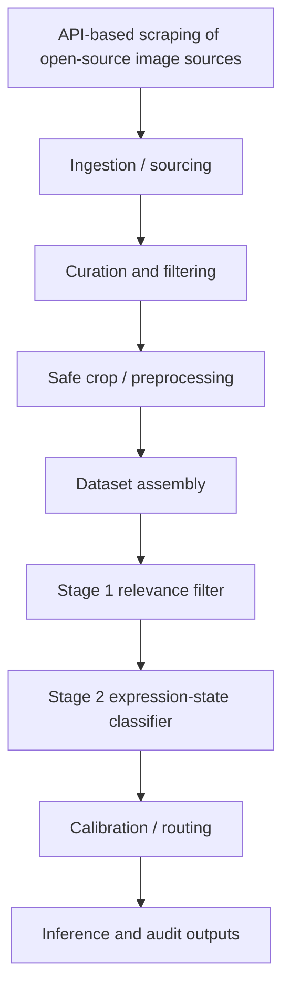

# Architecture

## High-level system model

AutoFACS CV/ML is best understood as a staged pipeline rather than a flat classifier. In this repository, the architecture is documented at the system-flow level: the emphasis is on how sourced inputs move through screening, classification, and review surfaces, not on exposing every private implementation mechanism of the working pipeline.

## Why the pipeline is staged

A single-stage model was not enough to solve the real engineering problem. The project had to deal with:

- low-quality or irrelevant facial samples
- mixed and noisy source datasets
- class-confusion problems in expression-adjacent states
- the need to route difficult cases for deeper review

A practical project lesson was that useful facial-state classification could not ignore **speech-active frames** or the need for a meaningful **neutral baseline**. In real footage, those distinctions materially affected downstream quality. The staged design created room to separate unusable inputs first and to model expression/state distinctions more deliberately later.

## Ingestion and sourcing

The project evolved beyond static benchmark experimentation. It also incorporated automated ingestion, including API-based scraping of open-source photo sources, as part of the longer-term shift toward a more documented and legally cleaner data base.

That sourcing layer is important context even though the fully automated schedule/orchestration side belongs more to the broader AutoFACS ecosystem than to this repository alone.

## Stage 1: relevance filtering

The first stage is a relevance filter, but in this project that role is broader than simple quality control. Stage 1 was introduced because real-world facial material spans far more expression states than could be cleanly labeled and curated within the project’s initial target taxonomy. Rather than forcing the downstream classifier to treat that entire expression universe as one flat problem, the system first separates the project’s curated target space from a deliberately broad **irrelevant** catch-all class.

In practice, that **irrelevant** side includes facial material that falls outside the clean 11-label state space addressed by Stage 2. It is intentionally broad rather than exhaustive: it captures many out-of-scope, weakly curated, ambiguous, or otherwise non-target cases without claiming to be a complete map of all real-world expression possibilities.

Role of Stage 1 in this architecture:

- preserve inputs that belong to the project’s curated downstream state space
- absorb a much larger set of out-of-scope or weakly curated facial material into a controlled screening layer
- reduce error propagation into Stage 2 by preventing the downstream classifier from being treated as an all-expressions-in-the-wild model

## Stage 2: expression/state classification

The second stage handles the main expression/state recognition task over filtered samples.

Public role of Stage 2:

- classify the facial sample into the project’s downstream state space
- support confidence-aware evaluation
- feed review/routing logic for hard cases and borderline predictions

## Calibration and routing

The project record supports treating calibration and reliability-aware review as intentional parts of the system design.

A careful public summary of that idea is:

- the project did not optimize only for top-line predictions
- it also cared about confidence quality and borderline-case handling
- error analysis and hard-negative review were part of iteration, not afterthoughts

## Broader project context

AutoFACS CV/ML sits inside a larger ecosystem that also includes private data-governance work and a separate CLI automation/control-plane track. Those related systems matter to the project, but they are not the center of this repository. Here, the focus remains on the CV/ML domain story.
