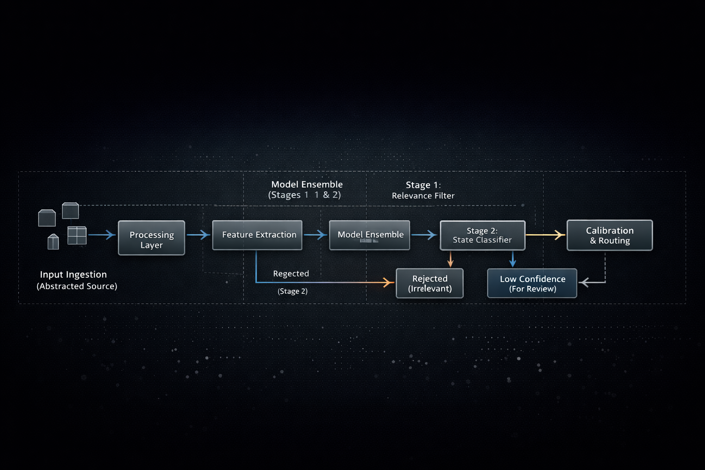

# AutoFACS CV/ML Docs Index

Start with the root README for the top-level summary, then use these pages for the deeper technical story.

1. [Project overview](PROJECT_OVERVIEW.md) — what the project is, what problem it addresses, and how it evolved
2. [Architecture](ARCHITECTURE.md) — the staged CV/ML design and how the main components fit together
3. [Data and boundaries](DATA_AND_BOUNDARIES.md) — what kinds of data the project uses and what remains outside the repo
4. [Model and training](MODEL_AND_TRAINING.md) — public-facing description of the modeling approach and environment constraints
5. [Evaluation and results](EVALUATION_AND_RESULTS.md) — selected V40 metrics and how to interpret them
6. [Engineering lessons](LIMITATIONS_AND_LESSONS.md) — what changed, what remained hard, and what the project learned
7. [Project direction and related tracks](ROADMAP.md) — where the project fits within the broader AutoFACS effort
8. [Public code included in this repository](PUBLIC_CODE_CANDIDATES.md) — the exemplary code layer included in `examples/`

## Recommended reading order

1. root `README.md`
2. `PROJECT_OVERVIEW.md`
3. `ARCHITECTURE.md`
4. `MODEL_AND_TRAINING.md`
5. `EVALUATION_AND_RESULTS.md`
6. `LIMITATIONS_AND_LESSONS.md`
7. `ROADMAP.md`
4