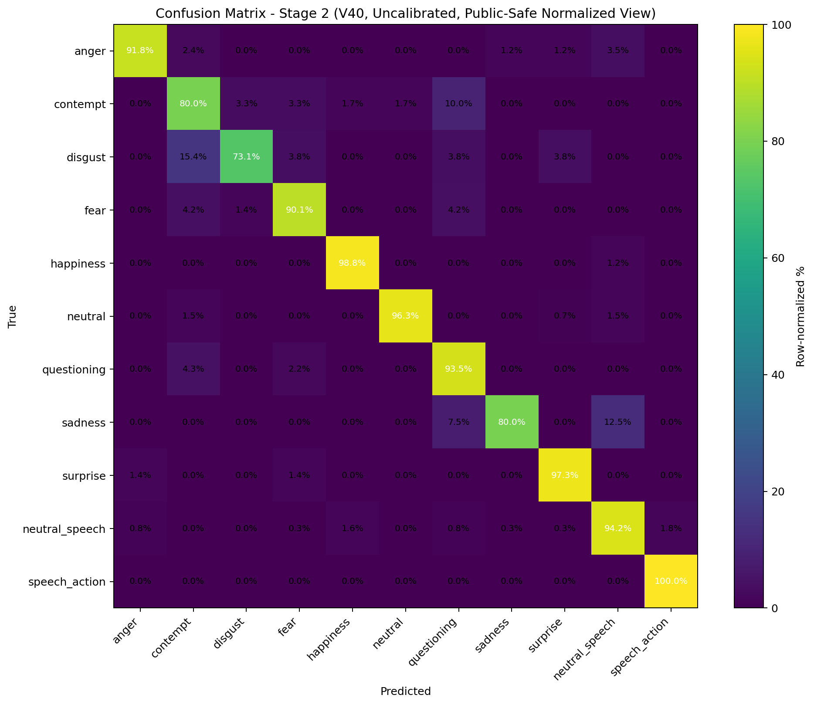
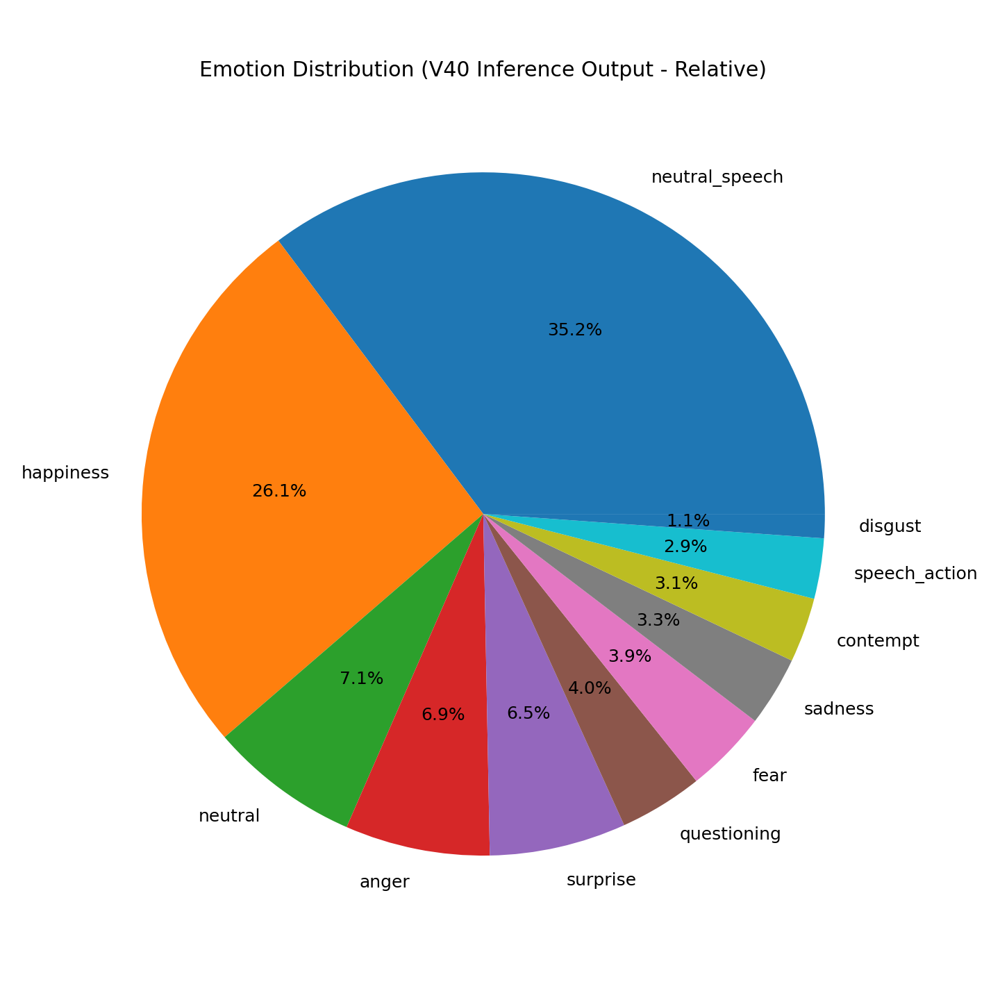
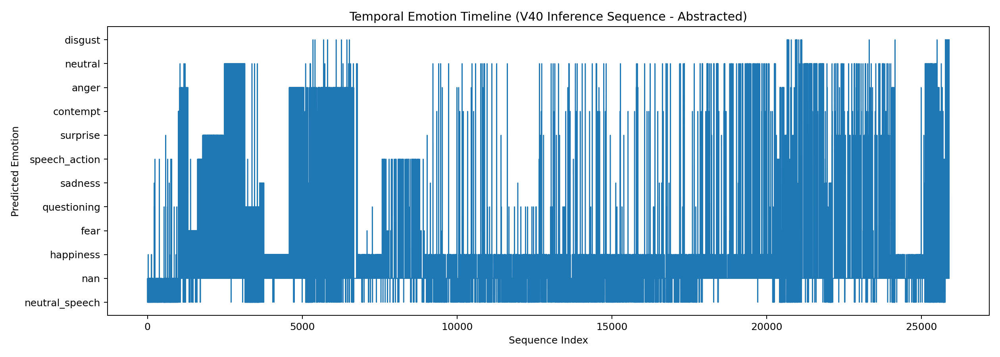

# Documentation Images

This directory contains images referenced directly within the project’s documentation.

The visuals included here are selected to communicate system behavior, model performance, and overall pipeline maturity while remaining consistent with the repository’s public, portfolio-safe scope.

## Included Visuals

### Core Figures

The primary visuals in this folder focus on illustrating the staged architecture and evaluation characteristics of the AutoFACS pipeline:

* **Stage 1 confusion matrix (V40)**
  Demonstrates that the relevance filtering stage operates as a learned classifier rather than a heuristic prefilter.
  

* **Stage 2 confusion matrix (V40, uncalibrated)**
  Represents the raw downstream classification surface prior to calibration.
  

* **Stage 2 confusion matrix (V40, calibrated)**
  Reflects the calibrated output space and aligns with the evaluation narrative presented in `docs/EVALUATION_AND_RESULTS.md`.
  

### Supporting Visuals

* **Emotion distribution summary (pie chart)**
  Provides a lightweight view of model outputs suitable for demonstration contexts.
  

* **Temporal emotion timeline**
  Illustrates how the system can represent expression signals over time, supporting the project’s inference and analysis use cases.
  

## Scope and Intent

These visuals are used most directly in [`../ARCHITECTURE.md`](../ARCHITECTURE.md) and [`../EVALUATION_AND_RESULTS.md`](../EVALUATION_AND_RESULTS.md), where they support the staged-system narrative and the public-facing evaluation story.

All visuals in this directory are curated to support understanding of:

* the staged model architecture
* the role of calibration in improving output quality
* the transition from raw classification to structured inference

These figures are intended to complement the documentation rather than reproduce full experimental artifacts.

## Boundaries

To maintain a clean separation between public materials and internal development assets, this folder intentionally excludes:

* raw or identifiable facial imagery
* curated training or evaluation datasets
* internal review artifacts or annotation tooling outputs
* any materials that would enable reconstruction of the private development environment

## Future Additions

Additional historical or comparative visuals (e.g., earlier model iterations or development lineage) may be incorporated in later documentation updates where appropriate.
